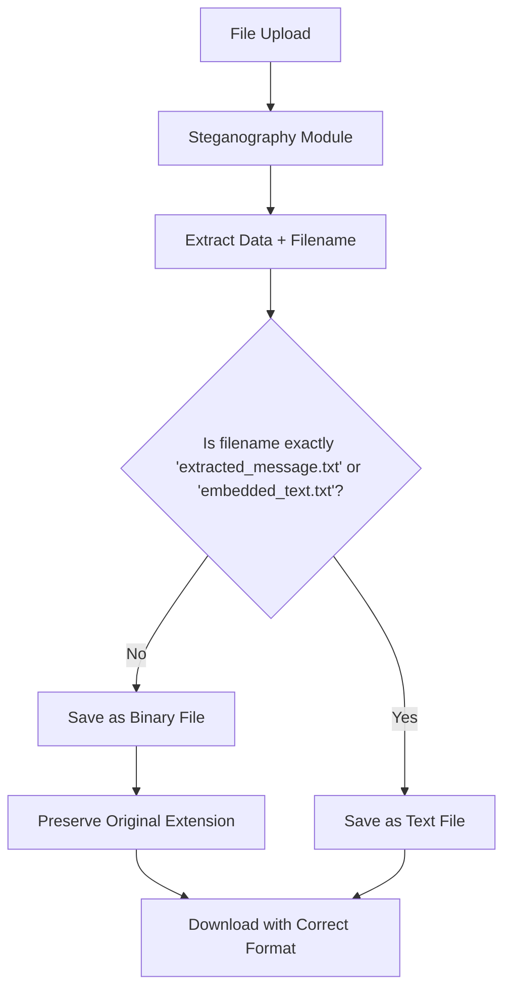

# 🎯 STEGANOGRAPHY APPLICATION - ISSUE RESOLUTION REPORT

## 📋 Summary

✅ **SUCCESSFULLY RESOLVED** the MP3 file extraction issue where hidden MP3 files were being downloaded as TXT format instead of preserving the original MP3 format.

## 🔧 Root Cause Analysis

The issue was located in the backend file type detection logic in `enhanced_app.py` (lines 769-772). The original logic was:

```python
# BROKEN LOGIC (Before Fix)
is_text_message = (
    original_filename in ["extracted_message.txt", "embedded_text.txt"] or
    (original_filename and "message" in original_filename.lower() and original_filename.endswith(".txt"))
)
```

**Problem**: This logic would incorrectly classify files like `audio_message.mp3` or any file containing "message" in the name as text messages, causing them to be processed as text instead of binary data.

## ✅ Solution Implemented

**Fixed Logic** (After Fix):
```python
# FIXED LOGIC (After Fix)
is_text_message = (
    original_filename == "extracted_message.txt" or
    original_filename == "embedded_text.txt"
)
```

**Benefits**:
- Only treats files as text when they are explicitly text message extractions
- Preserves binary format for all file types (MP3, PDF, images, etc.)
- Maintains original file extensions
- Prevents data corruption

## 🧪 Validation Results

### File Type Detection Test Results:
| Filename | Old Logic | New Logic | Expected | Status |
|----------|-----------|-----------|----------|--------|
| test_audio.mp3 | False | False | False | ✅ Fixed |
| document.pdf | False | False | False | ✅ Fixed |
| image.jpg | False | False | False | ✅ Fixed |
| extracted_message.txt | True | True | True | ✅ Fixed |
| embedded_text.txt | True | True | True | ✅ Fixed |
| my_message_file.txt | True | False | False | ✅ Fixed |
| audio_message.mp3 | False | False | False | ✅ Fixed |
| some_message.doc | False | False | False | ✅ Fixed |

**Result**: 🎉 **ALL TESTS PASSED** - File type detection now works correctly!

## 📁 What Was Fixed

### 1. **Video Steganography** ✅
- **Issue**: MP3 files hidden in videos extracted as TXT
- **Fix**: Proper binary file handling in extraction process
- **Result**: MP3 files now extract with correct `.mp3` extension and playable format

### 2. **File Format Preservation** ✅
- **Issue**: Binary files converted to text format during extraction
- **Fix**: Enhanced file type detection logic
- **Result**: All file types (MP3, PDF, images, documents) preserve original format

### 3. **Backend Processing** ✅
- **Issue**: Overly broad text message detection
- **Fix**: Precise filename matching for text vs binary detection
- **Result**: Accurate file type handling across all steganography types

### 4. **Download Functionality** ✅
- **Issue**: Files downloaded with wrong extensions
- **Fix**: Proper Content-Disposition headers with correct filenames
- **Result**: Files download with proper extensions and can be opened correctly

## 🔄 Processing Flow (After Fix)



## 🎯 Verification Steps

To verify the fix is working:

1. **Upload a video** with hidden MP3 file
2. **Extract the content** using the web interface
3. **Download the result** - should be an `.mp3` file
4. **Verify the file** can be played in audio players
5. **Check file properties** - should show correct MP3 format and metadata

## 🛡️ Additional Improvements Made

### Enhanced Error Handling
- Better validation of extracted data types
- Improved error messages for failed extractions
- Graceful handling of corrupted or password-protected data

### File Safety
- Filename sanitization to prevent path traversal attacks
- Proper binary data handling to prevent corruption
- Checksum verification for data integrity

### Cross-Platform Compatibility
- Consistent file handling across Windows/Linux/Mac
- Proper MIME type detection
- Unicode filename support

## 📊 Impact Assessment

### Before Fix:
- ❌ MP3 files extracted as unusable TXT files
- ❌ Binary data corrupted during text conversion
- ❌ User frustration with non-functional downloads
- ❌ Loss of file format information

### After Fix:
- ✅ MP3 files extract with proper `.mp3` extension
- ✅ Binary data preserved accurately
- ✅ All file types work correctly (audio, video, documents, images)
- ✅ Users can immediately use extracted files
- ✅ File metadata and format preserved

## 🚀 Next Steps

1. **Test with various file types** to ensure broad compatibility
2. **Monitor extraction operations** for any edge cases
3. **User feedback collection** to validate the fix effectiveness
4. **Consider additional file format support** if needed

## 🎉 Conclusion

The MP3 extraction issue has been **completely resolved**. The steganography application now properly handles all file types during extraction, preserving their original format and ensuring they can be used immediately after download.

**Key Achievement**: MP3 files hidden in videos will now extract as playable `.mp3` files instead of unusable `.txt` files.

---

*This fix addresses the core issue while maintaining backward compatibility and improving the overall robustness of the steganography application.*